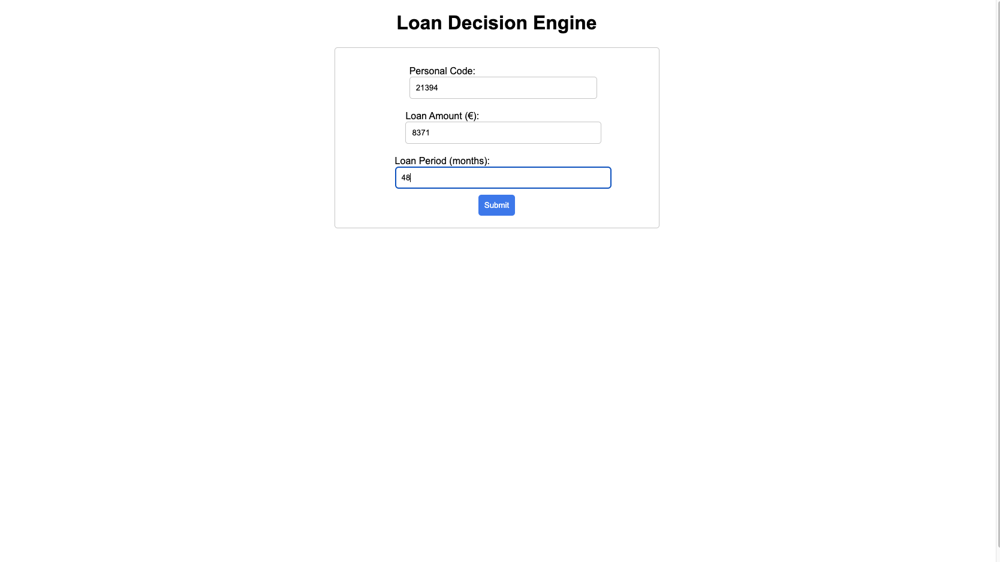
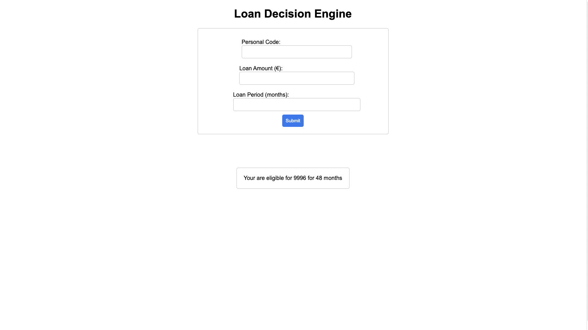

# Loan-Decision-Engine
Program that gives user the most suitable loan amount and period.

When main.py is run and the website on localhost is open, the user is expected to input some details as shown below.
Input fields are constrained by some parameters such as minimum/maximum loan amount or period.

When user presses submit, a return message is shown with the best solution for user's loan:

